# Bullhorn Chat

An AI-powered chat assistant specifically designed for Bullhorn ATS users. Access your Bullhorn data through natural language conversations, powered by advanced AI models with real-time data integration.

## Overview

Bullhorn Chat provides an intelligent conversational interface to your Bullhorn ATS system, allowing you to query candidates, jobs, clients, and more through simple chat interactions. Built with enterprise-grade security and performance in mind, it seamlessly integrates with your existing Bullhorn workflow.

### Key Features

- 🤖 **AI-Powered Conversations** - Natural language processing for intuitive Bullhorn data access
- 🔐 **Secure Bullhorn Authentication** - OAuth2 integration with your Bullhorn credentials
- 📊 **Live Data Access** - Real-time connection to your Bullhorn ATS via MCP (Model Context Protocol)
- 💬 **Conversation History** - Persistent chat history with intelligent title generation
- 🎨 **Modern UI** - Clean, responsive interface with light/dark mode support
- ⚡ **Fast & Reliable** - Streaming responses with optimized performance

## Prerequisites

- Node.js 18.x or later
- pnpm package manager
- Bullhorn ATS account with API access
- OpenAI API key for AI capabilities

## Installation

1. Clone the repository:
```bash
git clone https://github.com/your-org/bullhorn-chat.git
cd bullhorn-chat
```

2. Install dependencies:
```bash
pnpm install
```

3. Configure environment variables:
```bash
cp .env.example .env
```

## Configuration

### Required Environment Variables

```env
# OpenAI Configuration
NUXT_OPENAI_API_KEY=your-openai-api-key

# Bullhorn OAuth Configuration
NUXT_OAUTH_BULLHORN_CLIENT_ID=your-bullhorn-client-id
NUXT_OAUTH_BULLHORN_CLIENT_SECRET=your-bullhorn-client-secret

# Bullhorn MCP Server
NUXT_BULLHORN_MCP_URL=https://mcp.bullhornlabs.app

# Session Configuration
NUXT_SESSION_PASSWORD=your-secure-session-password
```

### Bullhorn OAuth Setup

1. Contact your Bullhorn representative to obtain OAuth credentials
2. Configure the redirect URI: `https://your-domain.com/auth/bullhorn`
3. Add the credentials to your `.env` file

## Development

Start the development server:

```bash
pnpm dev
```

The application will be available at `http://localhost:3000`

### Development Features

- Hot module replacement
- Type checking
- ESLint integration
- Automatic code formatting

## Usage

1. **Login**: Click "Sign in" and authenticate with your Bullhorn credentials
2. **Start Chatting**: Type your questions in natural language
3. **Access Data**: Query candidates, jobs, clients, and more
4. **View History**: Access previous conversations from the sidebar

### Example Queries

- "Show me all software engineers in Boston"
- "Find active job orders from last week"
- "What's the status of candidate John Smith?"
- "List all clients in the technology sector"

## Architecture

```mermaid
graph TB
    subgraph "Frontend - Vue/Nuxt Application"
        UI[Vue 3 UI Components]
        Store[Pinia State Management]
        Composables[Vue Composables]
        UI --> Store
        UI --> Composables
    end

    subgraph "Backend - Nuxt Server Routes"
        API[API Routes]
        Auth[Authentication Routes]
        SSE[SSE Streaming]
        Session[Session Management]
        API --> Session
        Auth --> Session
    end

    subgraph "Database Layer"
        D1[(Cloudflare D1/SQLite)]
        D1 --> Users[Users Table]
        D1 --> Chats[Chats Table]
        D1 --> Messages[Messages Table]
        D1 --> Corps[Corporations Table]
        D1 --> Feedback[Feedback Table]
    end

    subgraph "Authentication Providers"
        BullhornOAuth[Bullhorn OAuth 2.0]
        GoogleOAuth[Google OAuth 2.1]
        BullhornOAuth --> |JWT Tokens| Auth
        GoogleOAuth --> |Access/Refresh Tokens| Auth
    end

    subgraph "MCP Servers - Model Context Protocol"
        subgraph "Bullhorn ATS MCP"
            ATSMCP[ATS Server]
            ATSTools[Entity Tools<br/>- Candidates<br/>- Jobs<br/>- Clients<br/>- Contacts]
            ATSAuth[OAuth Proxy]
            ATSMCP --> ATSTools
            ATSMCP --> ATSAuth
        end

        subgraph "Bullhorn Analytics MCP"
            AnalyticsMCP[Analytics Server]
            AnalyticsTools[Analytics Tools<br/>- Reports<br/>- Dashboards<br/>- Metrics]
            AnalyticsCache[Redis Cache]
            AnalyticsMCP --> AnalyticsTools
            AnalyticsMCP --> AnalyticsCache
        end

        subgraph "SourceBreaker MCP"
            SBMCP[SourceBreaker Server]
            SBTools[Resume Tools<br/>- Parse<br/>- Search<br/>- Match]
            IrisAPI[IRIS Client]
            SBMCP --> SBTools
            SBMCP --> IrisAPI
        end

        subgraph "Google Workspace MCP"
            GoogleMCP[Workspace Server]
            GoogleTools[Google Tools<br/>- Gmail<br/>- Calendar<br/>- Drive<br/>- Docs/Sheets]
            GoogleAuth[OAuth 2.1 Handler]
            GoogleMCP --> GoogleTools
            GoogleMCP --> GoogleAuth
        end
    end

    subgraph "External Services"
        OpenAI[OpenAI API<br/>GPT-4]
        BullhornAPI[Bullhorn REST API]
        GoogleAPIs[Google APIs]
        IrisService[IRIS Service]
        RedisCloud[Redis Cloud]
    end

    %% Frontend to Backend connections
    UI --> API
    UI --> Auth
    Composables --> API
    Store --> SSE

    %% Backend to Database connections
    API --> D1
    Auth --> D1

    %% Backend to MCP connections
    API --> |HTTP/SSE| ATSMCP
    API --> |HTTP/SSE| AnalyticsMCP
    API --> |HTTP/SSE| SBMCP
    API --> |HTTP/SSE| GoogleMCP

    %% Backend to External Services
    API --> |Streaming| OpenAI

    %% MCP to External Services
    ATSAuth --> BullhornAPI
    AnalyticsMCP --> BullhornAPI
    SBMCP --> IrisService
    GoogleAuth --> GoogleAPIs
    AnalyticsCache --> RedisCloud

    %% Styling
    classDef frontend fill:#e1f5fe,stroke:#01579b,stroke-width:2px
    classDef backend fill:#fff3e0,stroke:#e65100,stroke-width:2px
    classDef database fill:#f3e5f5,stroke:#4a148c,stroke-width:2px
    classDef mcp fill:#e8f5e9,stroke:#1b5e20,stroke-width:2px
    classDef external fill:#fce4ec,stroke:#880e4f,stroke-width:2px
    classDef auth fill:#fff8e1,stroke:#f57f17,stroke-width:2px

    class UI,Store,Composables frontend
    class API,Auth,SSE,Session backend
    class D1,Users,Chats,Messages,Corps,Feedback database
    class ATSMCP,ATSTools,ATSAuth,AnalyticsMCP,AnalyticsTools,AnalyticsCache,SBMCP,SBTools,IrisAPI,GoogleMCP,GoogleTools,GoogleAuth mcp
    class OpenAI,BullhornAPI,GoogleAPIs,IrisService,RedisCloud external
    class BullhornOAuth,GoogleOAuth auth
```



### Technology Stack

- **Frontend**: Vue 3 + Nuxt 3 for a modern, performant UI
- **UI Components**: Nuxt UI Pro for consistent, accessible components
- **AI Integration**: OpenAI GPT-4 with Vercel AI SDK for streaming responses
- **Authentication**: Dual OAuth flows (Bullhorn OAuth 2.0, Google OAuth 2.1 with PKCE)
- **Database**: SQLite (development) / Cloudflare D1 (production)
- **Hosting**: Optimized for Cloudflare Workers
- **MCP Integration**: Model Context Protocol servers for secure API access

### Key Components

#### MCP Servers (Model Context Protocol)
- **Bullhorn ATS MCP**: Provides secure access to Bullhorn REST API with entity operations (candidates, jobs, clients, contacts)
- **Bullhorn Analytics MCP**: Handles analytics, reporting, and dashboard data with Redis caching
- **SourceBreaker MCP**: Integrates with IRIS for resume parsing, searching, and matching
- **Google Workspace MCP**: Manages Google services integration (Gmail, Calendar, Drive, Docs, Sheets)

#### Authentication Flow
1. **Bullhorn OAuth**: Primary authentication for Bullhorn ATS access
2. **Google OAuth**: Secondary authentication for Google Workspace features
3. **Session Management**: Secure token storage and rotation
4. **MCP Session Tokens**: Separate authentication layer for MCP server communication

### Security

- All API calls are authenticated and encrypted
- OAuth tokens are securely stored server-side
- Session tokens are rotated regularly
- No credentials are stored client-side
- Rate limiting and request validation
- PKCE implementation for OAuth 2.1 flows

## Production Deployment

Build for production:

```bash
pnpm build
```

Deploy to Cloudflare:

```bash
npx nuxthub deploy
```

### Production Considerations

- Set up proper SSL certificates
- Configure rate limiting
- Enable monitoring and logging
- Set up backup procedures
- Review security policies

## Support

For issues related to:
- **Bullhorn Integration**: Contact your Bullhorn administrator
- **Technical Issues**: Create an issue in this repository
- **Feature Requests**: Submit through the project board

## License

This project is proprietary software. All rights reserved.