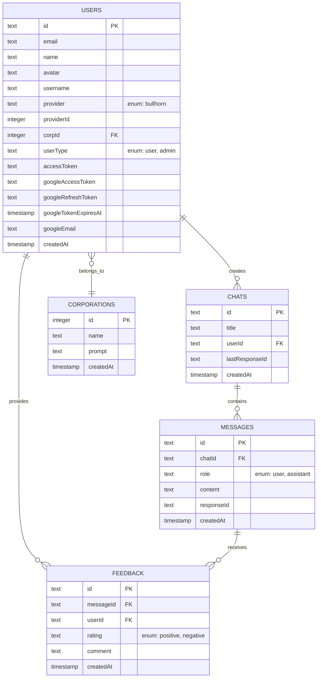

# Database Schema

## Entity Relationship Diagram

## Table Descriptions

### Corporations
Stores organization/corporation data for multi-tenant support.
- **id**: Corporation ID from Bullhorn
- **name**: Corporation name
- **prompt**: Custom AI prompt for the corporation
- **createdAt**: When the corporation was added

### Users
Stores user authentication and profile information.
- **id**: UUID primary key
- **email**: User's email address
- **name**: Display name
- **avatar**: Profile picture URL
- **username**: Username
- **provider**: Authentication provider (currently only 'bullhorn')
- **providerId**: ID from the authentication provider
- **corpId**: Foreign key to corporations table
- **userType**: Role ('user' or 'admin')
- **accessToken**: Bullhorn API access token
- **googleAccessToken**: Google OAuth access token
- **googleRefreshToken**: Google OAuth refresh token
- **googleTokenExpiresAt**: When the Google token expires
- **googleEmail**: Google account email
- **createdAt**: Account creation timestamp

### Chats
Stores chat sessions/conversations.
- **id**: UUID primary key
- **title**: Chat title (auto-generated from first message)
- **userId**: Foreign key to users table
- **lastResponseId**: OpenAI response ID for conversation continuity
- **createdAt**: When the chat was created

### Messages
Stores individual messages within chats.
- **id**: UUID primary key
- **chatId**: Foreign key to chats table (cascade delete)
- **role**: 'user' or 'assistant'
- **content**: Message text content
- **responseId**: OpenAI response ID for this specific message
- **createdAt**: Message timestamp

### Feedback
Stores user feedback on AI responses.
- **id**: UUID primary key
- **messageId**: Foreign key to messages table (cascade delete)
- **userId**: Foreign key to users table (cascade delete)
- **rating**: 'positive' or 'negative'
- **comment**: Optional feedback comment
- **createdAt**: Feedback submission timestamp

## Indexes

- **chats**: `userIdIdx` on userId
- **messages**: `chatIdIdx` on chatId
- **feedback**: 
  - `messageIdIdx` on messageId
  - `userIdIdx` on userId
  - Unique constraint on (messageId, userId)

## Relationships

1. **Users ↔ Corporations**: Many-to-One
   - Multiple users can belong to one corporation
   - Corporation assignment happens during Bullhorn authentication

2. **Users ↔ Chats**: One-to-Many
   - A user can have multiple chat sessions
   - Chats are user-specific

3. **Chats ↔ Messages**: One-to-Many
   - A chat contains multiple messages
   - Messages are deleted when chat is deleted (cascade)

4. **Messages ↔ Feedback**: One-to-Many
   - A message can have multiple feedback entries
   - Each user can only provide one feedback per message (unique constraint)

5. **Users ↔ Feedback**: One-to-Many
   - A user can provide feedback on multiple messages
   - Feedback is deleted when user is deleted (cascade)

## Data Flow

1. **Authentication Flow**:
   - User authenticates via Bullhorn OAuth
   - User record created/updated with corporation assignment
   - Google OAuth tokens stored when user connects Google Workspace

2. **Chat Flow**:
   - User creates chat session
   - Messages are exchanged and stored
   - OpenAI response IDs tracked for conversation continuity

3. **Feedback Flow**:
   - Users can rate assistant messages
   - One feedback entry per user per message
   - Used for training data and quality monitoring